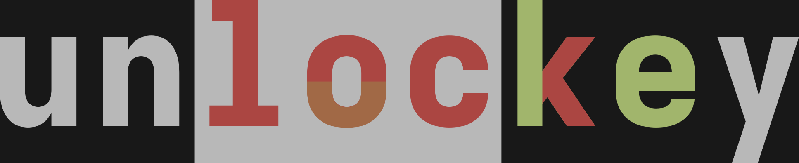

# Unlockey

Unlockey is a decentralized messenger to help it's users bypass blockages and
connect to each other.

## Where does the name come from?

The name of this project comes from
[this debate (or discussion)](https://youtu.be/PqpYxD71hJU) between two western
philosophers (or thinkers). At some point in this discussion, they talk about
political (or regional) **borders** and how lucky they are for being born within
the right borders. 
This piece of software is a desperate attempt to be a key (or a solution) for
those who aren't lucky and are locked up within the wrong borders. That's where
the name is coming from, it's coming from an exhausion which is the result of
being blocked from within and being banned from outside.

## Want to contribute?

I would appreciate **any** contribution. 
my E-mail: amirthehossein@gmail.com
